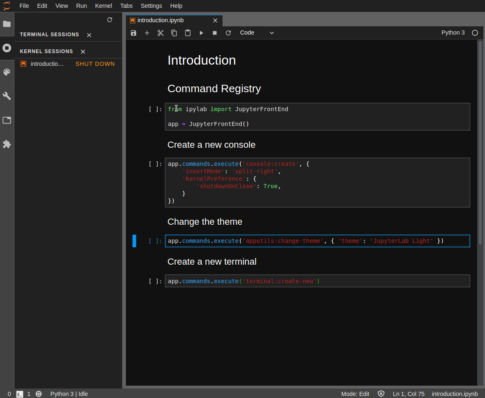

# ipylab

Control JupyterLab from Python notebooks.

The goal is to provide access to most of the JupyterLab environment from Python notebooks. For example:

- Adding widgets to the main area `DockPanel`, left, right or top area
- Build more advanced interfaces leveraging `SplitPanel`, `Toolbar` and other Phosphor widgets
- Launch arbitrary commands (new terminal, change theme, open file and so on)
- Open a workspace with a specific layout

## Examples

### Command Registry



## Installation

You can install using `pip`:

```bash
pip install ipylab
jupyter labextension install @jupyter-widgets/jupyterlab-manager ipylab
```

## Development

```bash
python -m pip install -e .
jlpm && jlpm run build
jupyter labextension install @jupyter-widgets/jupyterlab-manager . --debug
```
