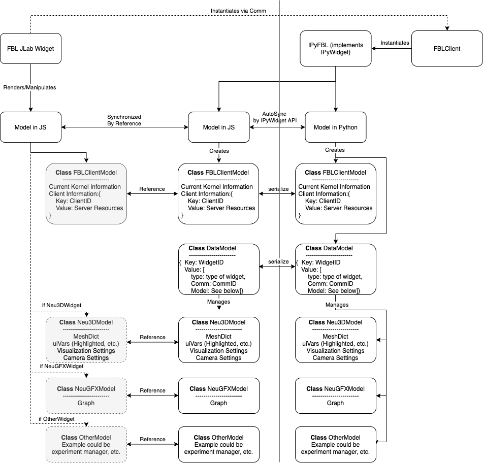

# IPyFBL
Provides automatic model synchronization between JLab Widgets and Python Kernel via IPyWidget middleman.
Inspired by [IPyLab](https://github.com/jtpio/ipylab).

## Installation
```bash
conda create -n ipyfbl python=3.7 nodejs -y
conda activate ipyfbl
pip install jupyter jupyterlab
pip install -e. ".[dev]"
jlpm && jlpm run build
# if you do not have jupyterlab-manager installed already
jupyter labextension install @jupyter-widgets/jupyterlab-manager
jupyter labextension link .

npm run watch
# in a separate browser
# unfortunately JLab watch mode does not work yet. 
# we will have to resort to 
jupyter lab
```


# Overview


## Note on WorkFlow
1. By default, in the JLab entry point FBL widgets are instantiated without a kernel and is used for pure visualization purposes.
2. If the FBL Widget then connects to a kernel, the model of the FBL Widget will be passed to the FBLClient's DataModel and shared to make sure the data is in sync.
3. Models in Client's DataModel are key-ed by Widget's unique global ID, which avoids conflict between models.

## Note on Model

1. Model data need to be JSON serializable. (i.e. Number, string, object in JS)
2. A set of serializable types have been implemented in ipywigdet, int, List, Dict, etc.
3. Mutable Types (List, Dict, Set) have issue with triggering change event since their ids remain unchanged. Either manually trigger change events or avoid using them
4. Custom Type/Serialization can be implemented for (for instance) sync partial data.
5. DataModel should be able to pool data from widgets together.